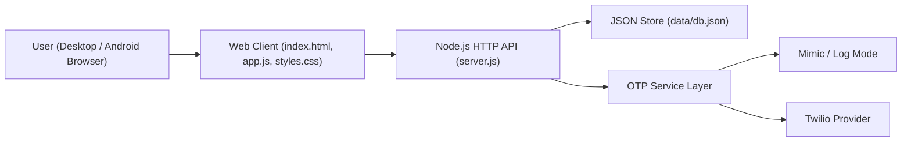
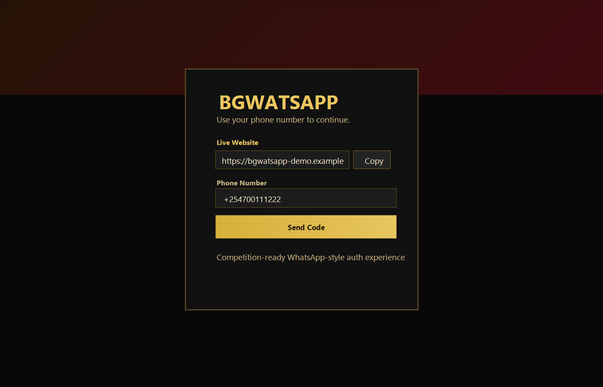
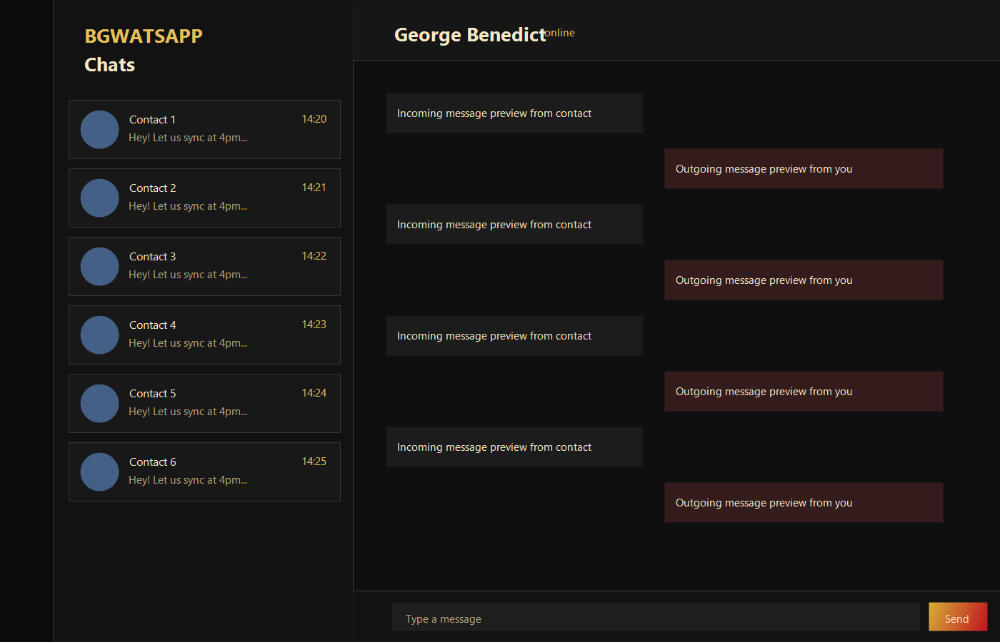
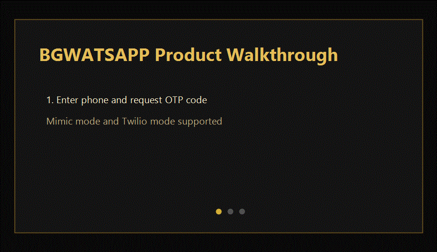

# BGWATSAPP

[](https://github.com/georgebenedict77/bgwatsapp/actions/workflows/ci.yml)
[](https://github.com/georgebenedict77/bgwatsapp/releases)
[](./LICENSE)

Modern full-stack messaging web app with OTP auth, real-time chat UX patterns, and a competition-ready black/gold/red visual system.

## Product Positioning

BGWATSAPP is positioned as a **showcase-ready messaging platform prototype** for:
- portfolio demonstrations
- startup MVP pitching
- internal product concept validation

It demonstrates end-to-end ownership: UI/UX polish, backend APIs, auth flow, production-minded configuration, and CI quality gates.

## One-Click Launch

- [Launch BGWATSAPP on Replit](https://replit.com/github.com/georgebenedict77/bgwatsapp)
- [Launch BGWATSAPP on StackBlitz (backup)](https://stackblitz.com/fork/github/georgebenedict77/bgwatsapp?startScript=start)

## Problem

Typical messaging-clone projects look incomplete to non-technical reviewers because they miss:
- clear onboarding/login flow
- credible application shell and interactions
- production-style docs and release hygiene

## Solution

BGWATSAPP packages messaging features with presentation-grade framing:
- OTP login (mimic or Twilio-ready)
- contacts, groups, chat controls, scheduler, and settings
- polished docs, CI checks, screenshots/GIF, changelog, and licensing

## Architecture



## Core Features

- Phone-number OTP authentication
- Direct and group chat creation
- Contacts directory and sidebar navigation rail
- Chat actions: pin, mute, favorite, read, search, reply, schedule
- Mod-style settings panel (privacy + appearance + app lock)
- Live Website share block on login screen

## Screenshots & Walkthrough

### Auth Experience


### Chat Workspace


### Product Walkthrough GIF


## Local Setup

```bash
git clone https://github.com/georgebenedict77/bgwatsapp.git
cd bgwatsapp
npm install
npm start
```

Open: `http://localhost:3000`

If port `3000` is already in use:

```powershell
$env:PORT=3900
npm start
```

## Environment Configuration

Copy `.env.example` to `.env`.

| Variable | Purpose | Example |
| --- | --- | --- |
| `OTP_SMS_PROVIDER` | OTP mode (`mimic`, `log`, `twilio`) | `mimic` |
| `OTP_ALLOW_DEV_CODE` | Shows demo code in mimic/log flow | `true` |
| `APP_PUBLIC_URL` | Public production URL shown in app | `https://your-app.onrender.com` |
| `TWILIO_ACCOUNT_SID` | Twilio account SID | `AC...` |
| `TWILIO_AUTH_TOKEN` | Twilio auth token | `...` |
| `TWILIO_FROM_NUMBER` | Twilio sender number | `+123...` |
| `TWILIO_MESSAGING_SERVICE_SID` | Optional Twilio messaging service | `MG...` |

## Deployment (Render Quick Path)

1. Create a new Web Service on Render and connect this repository.
2. Runtime: `Node`.
3. Build command: `npm install`
4. Start command: `npm start`
5. Set environment variables from the table above.
6. Deploy and set `APP_PUBLIC_URL` to the Render app URL.

## CI / Quality Gates

GitHub Actions workflow: `.github/workflows/ci.yml`

Pipeline runs on every push/PR:
- `npm ci`
- `npm test`
- syntax checks (`node --check`)
- API smoke test (`scripts/smoke-test.js`)

## Release Management

- Current release target: `v1.1.0`
- Release notes: `docs/releases/v1.1.0.md`
- Changelog: `CHANGELOG.md`

Tag locally:

```bash
git tag -a v1.1.0 -m "Portfolio and production-readiness release"
git push origin v1.1.0
```

## License

This project is licensed under the MIT License - see `LICENSE` for details.
